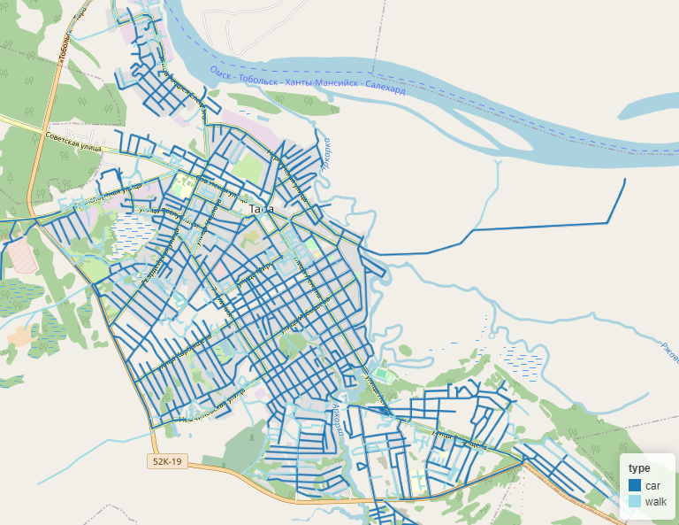
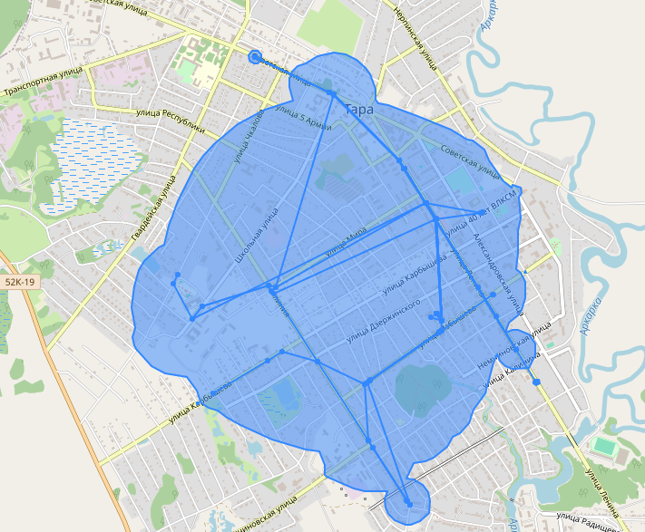
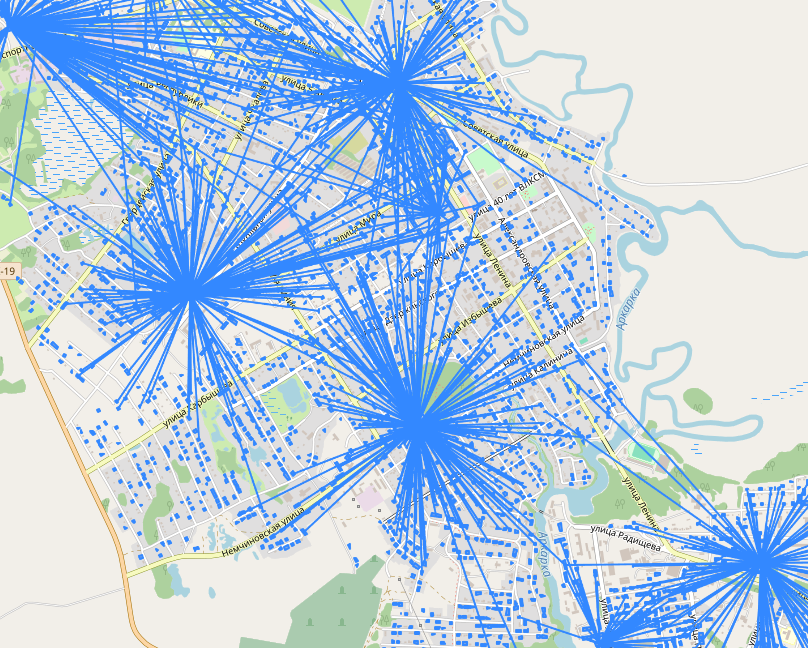

# ObjectNat - Meta Library

[](https://github.com/psf/black)


<p align="center">
</a>
</p>

**ObjectNat** is an open-source library created for geospatial analysis created by IDU team

## ObjectNat Components

- [dongraphio](https://github.com/DDonnyy/dongraphio) : `dongraphio` provides graph functions
- [provisio](https://github.com/DDonnyy/provisio) : `provisio` provides main provisio fuctions
- [population-restorator](https://github.com/kanootoko/population-restorator) : `restorator` provides city resettlement

## Features and how to use

1. [City graph from OSM](./examples/graph_generator.ipynb) - Function to assemble a road, pedestrian, and public
   transport graph from OpenStreetMap (OSM) and creating Intermodal graph.

   </a>
   
2. [Adjacency matrix](./examples/calculate_adjacency_matrix.ipynb) - Calculate adjacency matrix based on the provided
   graph and edge weight type (time or distance). The intermodal graph can be obtained using the previous example.
3. [Isochrones,transport accessibility](./examples/isochrone_generator.ipynb) - Function for generating isochrones to
   analyze transportation accessibility from specified starting coordinates. Isochrones can be constructed based on
   pedestrian, automobile, or public transport graphs, or a combination thereof.

   </a>

4. [Population restoration](./examples/restore_population.ipynb) - Function for resettling population into the provided
   layer of residential buildings. This function distributes people among dwellings based on the total city population
   and the living area of each house.
5. [Service provision](./examples/calculate_provision.ipynb) - Function for calculating the provision of residential
   buildings and population with services. In case of missing data, this function utilizes previously described
   functionality to retrieve the necessary information.

   </a>

## Installation

**ObjectNat** soon ~~can be installed with~~ ``pip``:

```
pip install ObjectNat
```

## Contacts

## Publications
